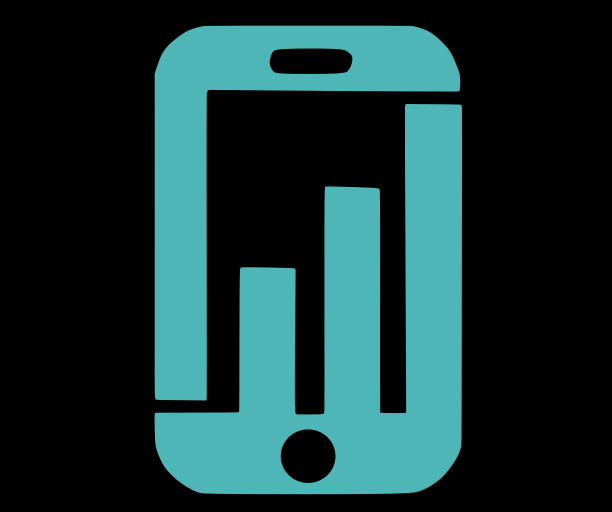
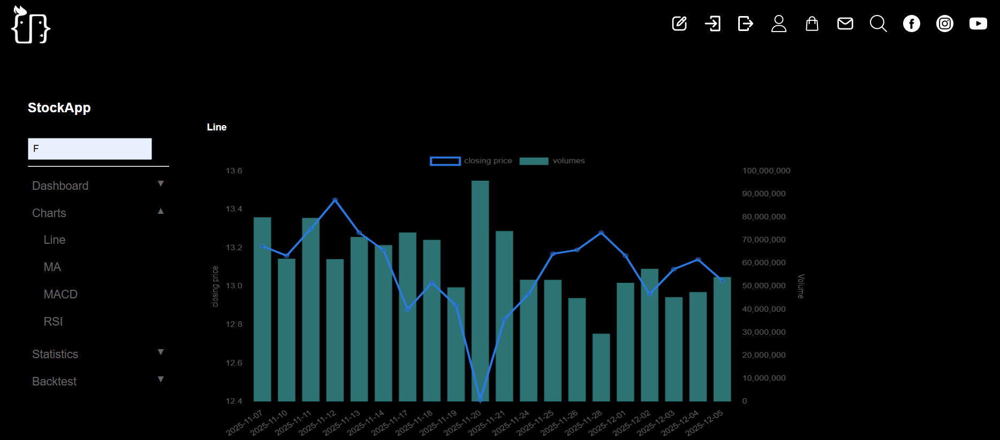
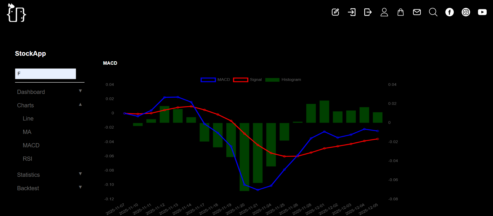
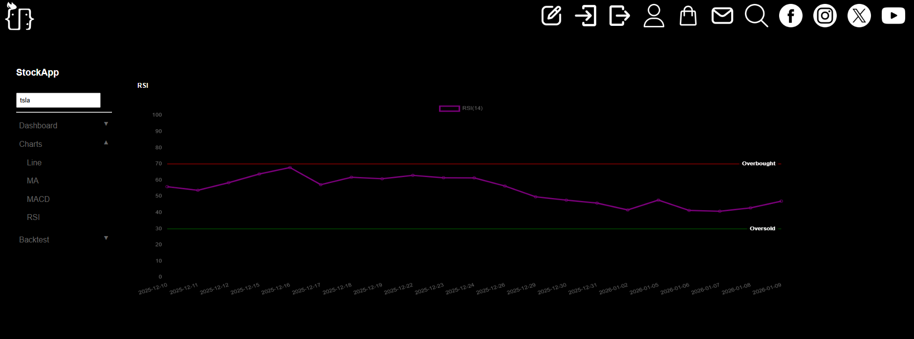

  

<h1 align="center">StockApp Free</h1>

💡 Analyze stocks like a pro — right from your browser!

  Free online stock analysis app with technical indicators and interactive charts.

  

---

## 🚀 Introduction

StockApp Free is a **lightweight, web-based stock analysis tool** designed for:

- Investors looking for fast insights  
- Learners who want to practice technical analysis  
- Market enthusiasts who want interactive charts  

No installation required — just open your browser and start analyzing immediately.  

---

## ✨ Features

- 📈 **Real-time interactive stock charts**  
- 📊 **Track technical indicators**: RSI, MACD, SMA  
- ⚡ **Simple interface** for beginners, **advanced tools** for pros  
- 🌐 **100% web-based**, works on any device  
- 🧠 **Fast, focused, and beginner-friendly**

---

## 🧭 How to Use

1. Open the website  
2. Enter a stock symbol  
3. Select indicators and timeframes  
4. Start analyzing  

  

---

## 🖼 Screenshots

  
  

  
  

---

## 📌 Project Status

- ✅ **Live and accessible online**  
- 🔄 **Actively improving** with new features  
- 🧩 **Planned**: more indicators & backtesting tools  
- 🚀 **Vision**: practical financial tools for everyone  

---

## 🔒 Source Code Policy

This project is **NOT open source**.  
The repository is used for:

- Product introduction  
- Updates & announcements  
- Issue tracking  
- User feedback  

All application source code is privately maintained.

---

## 💬 Feedback

Have ideas, feature requests, or found a bug?  
Please use **GitHub Issues** to let us know.

---

## 🌱 Vision

Building practical financial tools that make market analysis **simpler, smarter, and more accessible**.

---

## 🌐 Follow Us

  <a href="https://www.youtube.com/@Code_Play_com" target="_blank">🎥 YouTube</a> | 
  <a href="https://www.facebook.com/codeplay0130/" target="_blank">📘 Facebook</a> | 
  <a href="https://www.instagram.com/codeplay0130/" target="_blank">📸 Instagram</a> | 
  <a href="https://x.com/Code_Play_/" target="_blank">🐦 Twitter</a>

---

⭐ If you find this project useful, consider giving it a star — it helps a lot!
